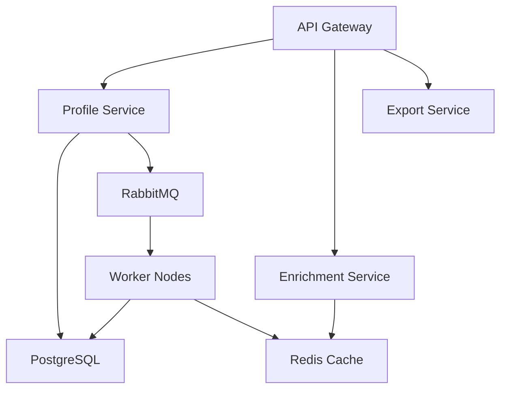
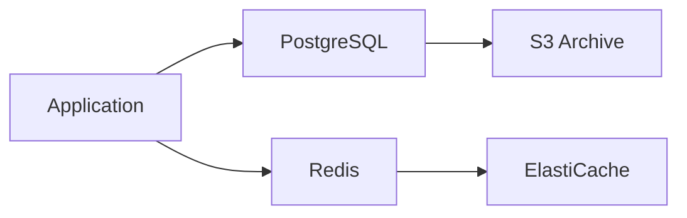
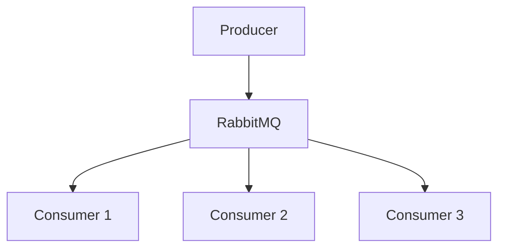
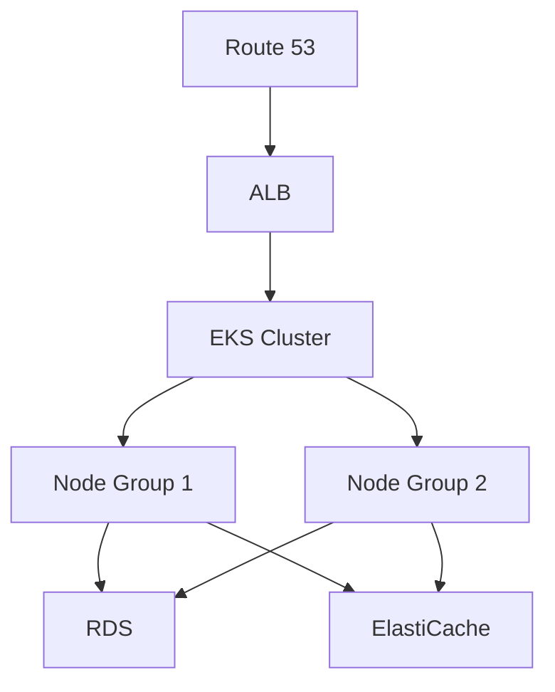
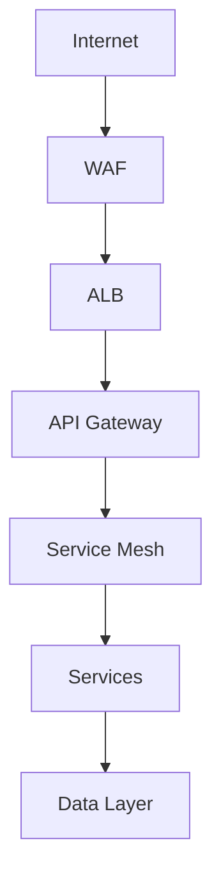
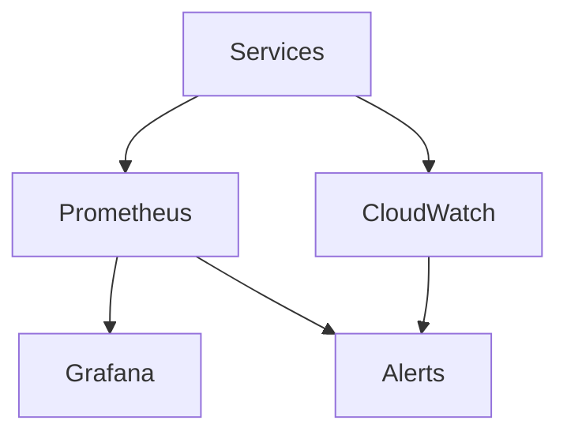

```markdown
# System Architecture

## Overview

Gray Ghost is a distributed system designed for scalable data enrichment and processing. The architecture follows microservices principles with event-driven communication.

## System Components



### Core Services

1. API Gateway
   - Rate limiting
   - Authentication
   - Request routing

2. Profile Service
   - Profile management
   - Search functionality
   - Data validation

3. Enrichment Service
   - Data enrichment
   - Source integration
   - Quality scoring

4. Export Service
   - Data export
   - Format conversion
   - Batch processing

### Data Storage



1. PostgreSQL
   - Profile data
   - Company data
   - Relationship data

2. Redis
   - Cache layer
   - Rate limiting
   - Session storage

### Message Queue



1. RabbitMQ
   - Task distribution
   - Event handling
   - Message routing

## Deployment Architecture



### Infrastructure

1. AWS Services
   - EKS for container orchestration
   - RDS for database
   - ElastiCache for Redis
   - S3 for storage

2. Kubernetes Resources
   - Deployments
   - Services
   - ConfigMaps
   - Secrets

## Security Architecture



1. Network Security
   - WAF protection
   - VPC isolation
   - Security groups

2. Application Security
   - JWT authentication
   - Role-based access
   - Data encryption

## Monitoring Architecture



1. Metrics Collection
   - Prometheus
   - CloudWatch
   - Custom metrics

2. Visualization
   - Grafana dashboards
   - CloudWatch dashboards
   - Custom reports
```